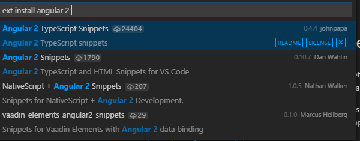

# VSCodeSnippetsComparison

Below is the comparison between VS Code extensions for Angular 2 code snippets from [Dan Wahlin (DW)](http://blog.codewithdan.com/2016/03/19/angular-2-typescript-and-html-snippets-for-vs-code/) and [John Papa (JP)](http://www.johnpapa.net/vscode-ng-snippets/).

My personal pick would be DW's as his extension has a few more snippets than JP's. Having said that, both of them work just as well but your preference might be different.  

This comparison came about when I saw the difference in the number of downloads between them at the time of writing this. 1790 (DW) compared to 24404 (JP).

Legend:  
&#10004; = F  
\- = Not supported

|                                            |    |    |                                         | 
|--------------------------------------------|----|----|-----------------------------------------| 
|                                            | JP | DW | Comments                                | 
|**TypeScript Snippets**                                            |    |    |                                         |
| Bootstrap snippet                          |    | &#10004;  | extra imports                           | 
| Component snippet                          | :+1:  |    | added moduleid in component declaration | 
| Component root                             | &#10004;  | -  |                                         | 
| Http module import snippet                 | -  | &#10004;  |                                         | 
| Http map() snippet                         |    | &#10004;  | nicer to read                           | 
| @Input property snippet                    | -  | &#10004;  |                                         | 
| @Output event snippet                      | -  | &#10004;  |                                         | 
| Pipe snippet                               |    | &#10004;  | strongly typed                          | 
| @Routes snippet                            | &#10004;  | &#10004;  | similar                                 | 
| Route definition snippet                   | &#10004;  | &#10004;  | similar                                 | 
| Service snippet                            | &#10004;  | &#10004;  | same                                    | 
| Observable subscribe snippet               |    | &#10004;  | nicer to read                           | 
| provide() with useClass                    | -  | &#10004;  |                                         | 
|                                            |    |    |                                         | 
| **HTML Snippets**                                           |    |    |                                         | 
| [class] binding snippet                    | -  | &#10004;  |                                         | 
| [ngClass] snippet                          | &#10004;  | &#10004;  | same                                    | 
| *ngFor snippet                             | &#10004;  | &#10004;  | same                                    | 
| ngForm snippet                             | -  | &#10004;  |                                         | 
| *ngIf snippet                              | &#10004;  | &#10004;  | same                                    | 
| [(ngModel)] binding snippet                | &#10004;  | &#10004;  | same                                    | 
| basic [routerLink] snippet                 | &#10004;  | &#10004;  | same                                    | 
| [routerLink] with router parameter snippet | -  | &#10004;  |                                         | 
| [ngSwitch] snippet                         | &#10004;  | &#10004;  | same                                    | 
| [ngStyle] snippet                          | &#10004;  | &#10004;  | same                                    | 
| <select> control using *ngFor snipppet     | -  | &#10004;  |                                         | 
| [style] binding snippet                    | -  | &#10004;  |                                         | 

Happy to hear your thoughts!